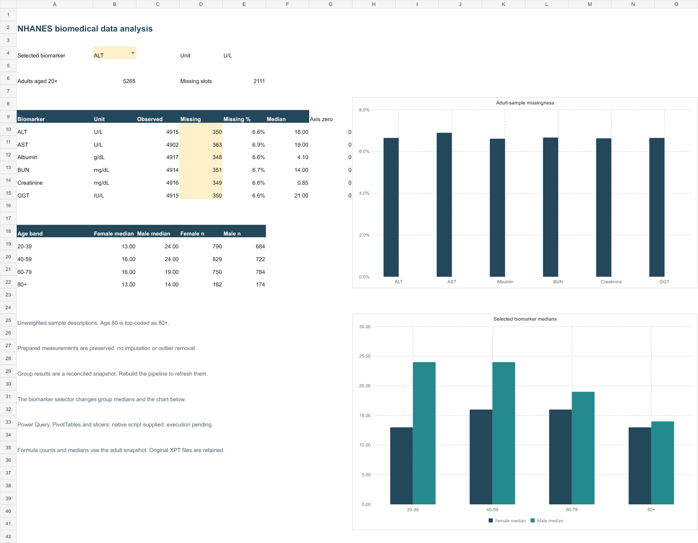

# NHANES biomedical data analysis

**A data analyst portfolio with a biomedical focus: real public data, Excel reporting, Power Query transformations and independently checked SQLite analysis.**

How do the availability and distributions of six liver and kidney biomarkers vary by age and recorded sex in the adult NHANES sample?

Start with [the project guide](START_HERE.md).

## Explore the deliverables

- [Native Excel review copy](excel/NHANES_Native_Excel.xlsx): recalculated, saved and reopened in desktop Excel; contains the same dashboard and source tables.
- [Original authored Excel dashboard](excel/NHANES_Dashboard.xlsx): populated source tables, formula summaries, a biomarker selector, conditional formatting and editable charts.
- [Three-page analysis report](reports/NHANES_analysis.pdf): findings, transformation decisions and verification status.
- [SQLite database](data/processed/nhanes.sqlite): open directly in SQLiteStudio; inspect source tables and analysis views.
- [CSV outputs](data/processed/): joined records, adult cohort, long measurements, group summaries and cleaning log.
- [Power Query queries](excel/power-query/) and [native Excel completion script](excel/Complete-Excel.ps1).
- [Skills and evidence](docs/skills.md), [methodology](docs/methodology.md), [verification](docs/verification.md).

## Results worth noticing

| Checkpoint | Result |
| --- | ---: |
| Biochemistry records matched to demographics | 6,401 / 6,401 |
| Adults aged 20+ | 5,265 |
| Measurement slots across six biomarkers | 31,590 |
| Observed measurements | 29,479 |
| Missing measurement slots retained | 2,111 |
| Values imputed / outliers removed | 0 / 0 |

Adult-sample missingness ranges from **6.61% for Albumin to 6.89% for AST**. The small differences are shown with a zero baseline in the report. Every biomarker has the same participant denominator, because the reshape retains missing slots.

For ALT, observed-value medians for female/male participants are 13/24 U/L at ages 20–39, 16/24 at 40–59, 16/19 at 60–79 and 13/14 at 80+. These are descriptive results for the included sample. They do not establish a clinical diagnosis or explain why the groups differ.

**Scope:** summaries are unweighted. They are not US population estimates. Survey weights, strata and primary sampling units are retained for a later survey-design analysis. Age 80 is top-coded by the source and is displayed as 80+.

## The workflow

Original CDC XPT files → hash and key checks → selected source fields → checked participant join → adult cohort → null-preserving long format → independent SQLite reconstruction → Excel, CSV and PDF outputs.

The six biomarkers are ALT, AST, GGT, Albumin, Creatinine and blood urea nitrogen (BUN). Original measurement units and values are preserved. Cleaning corrects tiny floating-point decoder artifacts in specified code/weight fields, maps labels, and logs every operation. A pooled adult 1.5-IQR rule identifies measurements for statistical review; flagged values remain in the analysis.

## What has actually been verified

| Component | Status |
| --- | --- |
| Original source hashes, key checks, join and CSV round trips | Passed locally |
| SQLite integrity and foreign keys | Passed locally |
| All 31,590 long rows and all 48 grouped summaries against independent SQL views | Passed locally |
| Six regression tests using the real downloaded data | Passed locally |
| Excel formula counts/medians and biomarker selector | Passed in the authoring engine and desktop Excel for ALT and Creatinine |
| Workbook and all three PDF pages | Visually reviewed |
| Native Excel open, full recalculation, save and reopen; 20,975 source/group/log rows compared | Passed |
| Native desktop Excel query refresh, PivotTables and slicers | **Pending: script activation was denied; app control could not enter query code reliably** |
| GitHub Actions workflow | [Passed on GitHub](https://github.com/derrickrichie5527-source/nhanes-biomedical-analysis/actions/runs/37650890215): pipeline, six tests and saved workbook checks |

The workbook is usable now as a populated analysis snapshot. It does not already contain the native Power Query/PivotTable/slicer features. The supplied script is intended to add them in a separate workbook; those features must not be represented as verified until the script succeeds in desktop Excel. Native Excel summary and selector checks are recorded separately from the pending query and PivotTable checks.

## Sources and project authorship

Source: CDC/NCHS, NHANES 2017–2018 [Standard Biochemistry Profile](https://wwwn.cdc.gov/Nchs/Data/Nhanes/Public/2017/DataFiles/BIOPRO_J.htm) and [Demographics](https://wwwn.cdc.gov/Nchs/Data/Nhanes/Public/2017/DataFiles/DEMO_J.htm). Retrieved 7 October 2026. Original files and hashes are recorded in [the source manifest](docs/source_manifest.json). These are real public-use observations; no synthetic dataset is included.

The portfolio's originality lies in its question, transformations, audit trail, cross-tool reconciliation and presentation. The underlying observations belong to the credited source.

The MIT license applies to project code and original documentation. It does not replace the CDC source attribution or govern the source dataset.
